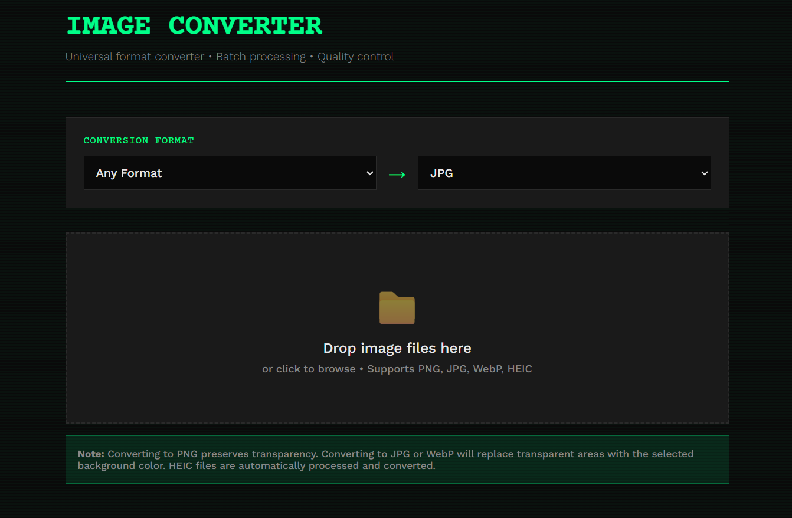

# Universal Image Format Converter

A fast, browser-based batch image converter that supports multiple formats including PNG, JPG, WebP, and HEIC with quality control and transparency handling.



## ✨ Features

- **🔄 Multi-Format Support** - Convert between PNG, JPG, WebP, and HEIC formats
- **📱 HEIC Support** - Convert iPhone/iOS photos (HEIC) to web-friendly formats
- **↔️ Bidirectional Conversion** - Any format to any format (PNG→JPG, JPG→PNG, HEIC→JPG, etc.)
- **🚀 Batch Processing** - Convert multiple images at once
- **🎨 Quality Control** - Adjust compression quality for JPG and WebP (1-100%)
- **🎯 Transparency Handling** - Choose white, black, or custom background colors
- **💾 Offline Support** - Works completely offline, no server required
- **🗑️ Individual File Management** - Remove specific files or clear all
- **📱 Responsive Design** - Works on desktop and mobile browsers
- **⚡ Instant Downloads** - Each converted file downloads automatically
- **🔒 Privacy First** - All processing happens in your browser, nothing uploaded to servers

## 🔄 Supported Conversions

| From → To | PNG | JPG | WebP |
|-----------|-----|-----|------|
| **PNG**   | ✅  | ✅  | ✅   |
| **JPG**   | ✅  | ✅  | ✅   |
| **WebP**  | ✅  | ✅  | ✅   |
| **HEIC**  | ✅  | ✅  | ✅   |

*Note: HEIC can only be used as input format (converted FROM, not TO)*

## 🚀 Live Demo

[Try it now!](https://easy-image-format-converter.netlify.app/)

## 📥 Installation

### Option 1: Use Online (Recommended)
Simply visit the live demo link above - no installation needed!

### Option 2: Download and Use Locally
1. Download `index.html` from this repository
2. Save it anywhere on your computer
3. Double-click the file to open in your browser
4. Bookmark it for easy access

### Option 3: Clone Repository
```bash
git clone https://github.com/Divyansh6661/Universal-Image-Format-Converter.git
cd Universal-Image-Format-Converter
# Open index.html in your browser
```

## 🎯 How to Use

1. **Select Conversion Format**
   - Choose input format (or select "Any Format" to accept all)
   - Choose output format (PNG, JPG, or WebP)

2. **Upload Files**
   - Drag and drop image files onto the drop zone
   - Or click to browse and select files
   - Add multiple files at once

3. **Configure Settings** (Optional)
   - Adjust output quality for JPG/WebP (PNG doesn't use compression)
   - Choose transparency background for non-PNG outputs (white/black/custom color)

4. **Convert**
   - Click "Convert All" button
   - Files download automatically as they're converted
   - Already converted files won't be re-converted

5. **Manage Files**
   - Click × to remove individual files
   - Click "Clear" to remove all files and start fresh

## 💡 Common Use Cases

- **HEIC → JPG**: Convert iPhone photos to universal format for sharing
- **HEIC → PNG**: Convert iOS images with transparency support
- **PNG → JPG**: Reduce file size for photos (removes transparency)
- **JPG → PNG**: Add transparency support or lossless quality
- **Any → WebP**: Modern format with better compression
- **WebP → JPG/PNG**: Compatibility with older systems

## 🛠️ Technical Details

- **Pure HTML/CSS/JavaScript** - No dependencies or frameworks
- **Canvas API** - Uses HTML5 Canvas for image processing
- **Client-side only** - Zero server interaction
- **Modern browsers** - Works on Chrome, Firefox, Safari, Edge

## 📋 Browser Support

- ✅ Chrome 90+
- ✅ Firefox 88+
- ✅ Safari 14+
- ✅ Edge 90+

## 🎨 Customization

The converter features a brutalist/terminal aesthetic with:
- Custom fonts (Courier Prime, Work Sans)
- Neon green accent color (#00ff88)
- Dark theme with animated interactions
- Smooth transitions and effects

Feel free to modify the CSS to match your preferred style!

## 📝 License

This project is licensed under the MIT License - see the [LICENSE](#) file for details.

## 🤝 Contributing

Contributions are welcome! Please feel free to submit a Pull Request.

1. Fork the repository
2. Create your feature branch (`git checkout -b feature/AmazingFeature`)
3. Commit your changes (`git commit -m 'Add some AmazingFeature'`)
4. Push to the branch (`git push origin feature/AmazingFeature`)
5. Open a Pull Request

## 💡 Future Enhancements

- [ ] Add image resize/scale options
- [ ] Support for additional formats (GIF, BMP, TIFF)
- [ ] Batch rename functionality
- [ ] Image preview thumbnails
- [ ] Export settings presets
- [ ] Drag to reorder files
- [ ] Watermark support
- [ ] Image optimization options

## 🐛 Issues

Found a bug? Please open an issue with:
- Browser and version
- Steps to reproduce
- Expected vs actual behavior

## 👏 Acknowledgments

- Built with vanilla JavaScript
- Fonts from Google Fonts
- Icons: Unicode characters
- HEIC conversion powered by [heic2any](https://github.com/alexcorvi/heic2any)

---

**Made with ❤️ for easy Universal-Image-Format-Converter**
